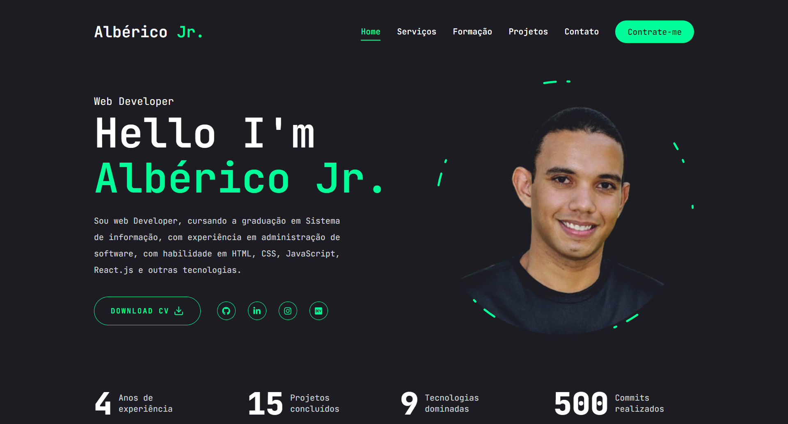
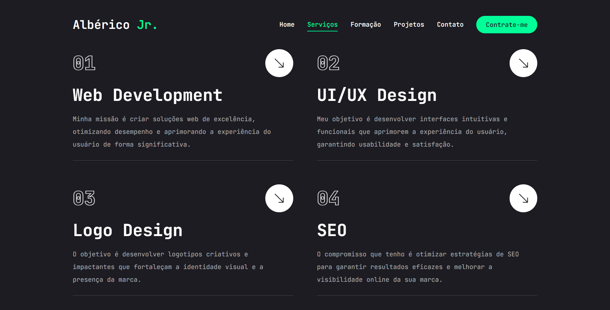
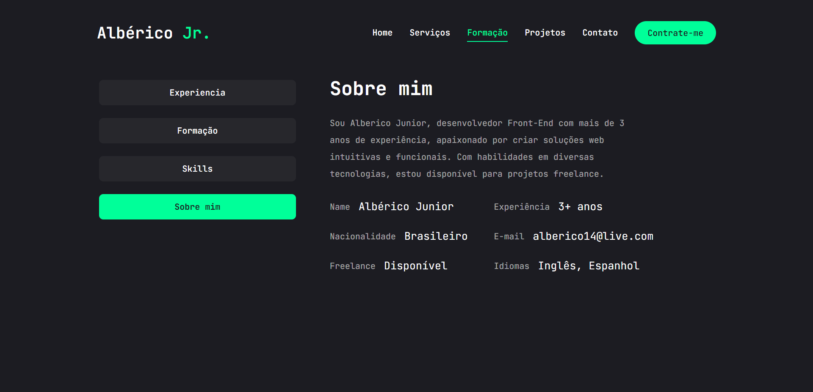
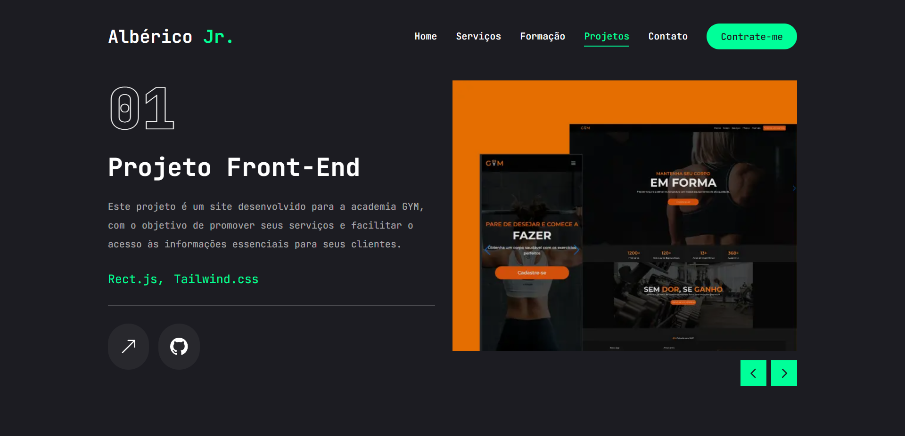
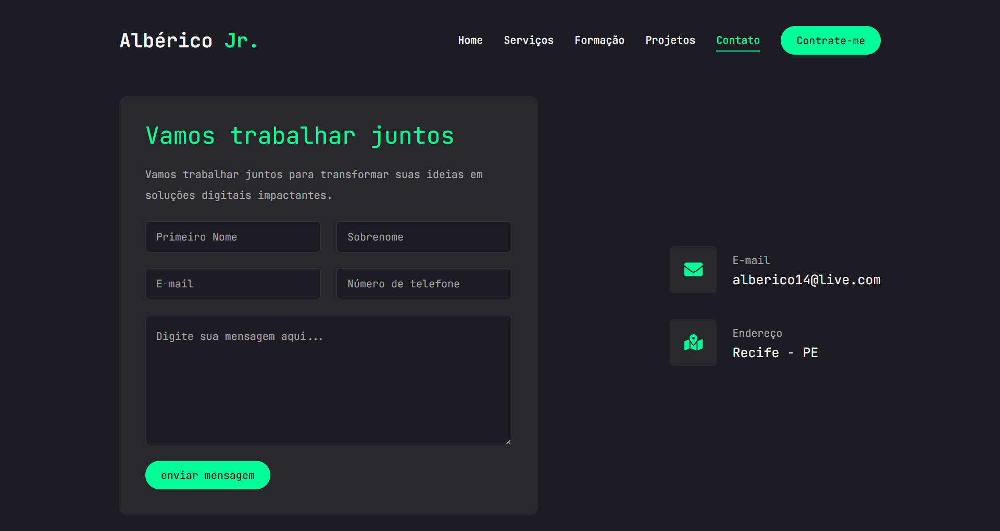

# Albérico Jr. Portfolio

Este portfólio foi desenvolvido utilizando Next.js e Tailwind CSS, proporcionando uma experiência de usuário fluida e visualmente atraente em diversos dispositivos.

## Tecnologias Utilizadas
### Next.js
* Garante um desempenho excepcional e otimizado para SEO, facilitando a indexação do seu trabalho pelos mecanismos de busca.

### Tailwind CSS

* Utilizado para estilizar o site de maneira rápida e eficaz com classes utilitárias.

* Permite um design moderno e responsivo, adaptável a diferentes dispositivos.

## Benefícios do Projeto
* Profissionalismo: Demonstra sua expertise em tecnologias modernas e sua capacidade de criar projetos de alta qualidade.

* Visibilidade: Aumenta sua presença online e atrai mais oportunidades de trabalho.

* Facilidade de manutenção: A estrutura do projeto facilita futuras atualizações e adições de novos projetos.

## [Albérico Jr.][def]

[def]: [P](https://portfolio-albericojr.vercel.app/)

